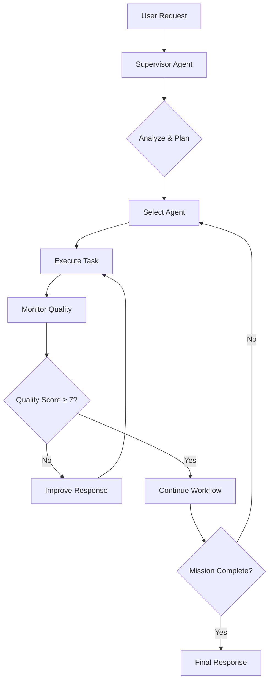
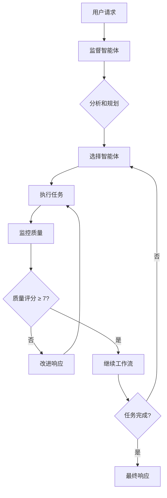

# MindForge Server 🧠

[English](#english) | [中文](#中文)

---

## English

### Overview

MindForge Server is an advanced AI-powered backend system featuring a sophisticated multi-agent architecture designed for intelligent personal knowledge management, journaling, and conversational AI. Built with Node.js, MongoDB, and integrated with multiple AI services, it provides a comprehensive platform for users to interact with AI agents that can understand, learn, and respond with context-aware intelligence.

### 🌟 Key Features

#### Multi-Agent AI System
- **9 Specialized AI Agents** working in coordinated workflows
- **Dynamic Agent Orchestration** with supervisor-driven task allocation
- **Quality Assurance** through monitoring and iterative improvement
- **Real-time Streaming** responses with workflow transparency

#### Intelligent Memory Management
- **RAG (Retrieval-Augmented Generation)** memory system
- **7 Memory Types**: User preferences, behavioral patterns, emotional patterns, topics of interest, goals, personal insights, conversation context
- **Advanced Search** with relevance scoring and pattern recognition
- **Persistent Learning** across conversations and sessions

#### Comprehensive Data Management
- **Personal Journaling** with versioning and tagging
- **Conversational History** with context preservation
- **User Authentication** via Clerk integration
- **Real-time Updates** with Redis caching

### 🤖 AI Agent Architecture

#### Core Agents

1. **Supervisor Agent** (`supervisor`)
   - **Role**: Central coordinator and workflow orchestrator
   - **Responsibilities**: Analyzes requests, plans responses, coordinates other agents
   - **Output**: JSON-structured task assignments and mission coordination

2. **Retrieval Agent** (`retrieval`)
   - **Role**: Information gathering and context search
   - **Capabilities**: Searches journals, memories, chat history for relevant context
   - **Integration**: RAG memory system and journal database

3. **Memory Agent** (`memory`)
   - **Role**: Long-term context and pattern management
   - **Functions**: Creates, updates, and manages user memories and insights
   - **Types**: Handles 7 different memory categories for comprehensive user modeling

4. **Tags Agent** (`tags`)
   - **Role**: Categorization and metadata generation
   - **Output**: Contextual tags in format `#tagname` (clean, no quotes/backticks)
   - **Integration**: Automatic tag application to journals and memories

5. **Emotion Agent** (`emotion`)
   - **Role**: Emotional intelligence and sentiment analysis
   - **Capabilities**: Analyzes emotional context, provides empathetic responses
   - **Pattern Recognition**: Identifies emotional triggers and behavioral patterns

6. **Enhancement Agent** (`enhancement`)
   - **Role**: Content improvement and enrichment
   - **Functions**: Improves response quality, suggests alternatives, adds insights
   - **Optimization**: Enhances user experience through iterative improvements

7. **Summarization Agent** (`summarization`)
   - **Role**: Information consolidation and structure
   - **Capabilities**: Synthesizes information, creates structured overviews
   - **Processing**: Handles complex information organization

8. **Report Agent** (`report`)
   - **Role**: Structured response generation and analysis
   - **Output**: Comprehensive, well-structured reports and insights
   - **Analytics**: Progress tracking and pattern analysis

9. **Monitor Agent** (`monitor`)
   - **Role**: Quality assurance and system monitoring
   - **Functions**: Evaluates response quality, ensures consistency
   - **Scoring**: 1-10 satisfaction scoring with improvement feedback

#### Workflow Process



### 🛠️ Technical Architecture

#### Backend Framework
- **Node.js** with Express.js
- **MongoDB** with Mongoose ODM
- **Redis** for caching and session management
- **Clerk** for authentication and user management

#### AI Integration
- **Moonshot/Kimi API** for LLM processing
- **OpenAI Agents Framework** for multi-agent coordination
- **Custom Agent System** with specialized prompts and workflows
- **Streaming Responses** with Server-Sent Events (SSE)

#### API Structure

##### Journal Management (`/api/journals`)
- **CRUD Operations**: Create, read, update, delete journals
- **Versioning System**: Track journal history and changes
- **Tag Management**: Add/remove tags from journal entries
- **Search Functionality**: Keyword and tag-based search
- **Bulk Operations**: Multi-journal updates and analysis

##### Chat System (`/api/chats`)
- **Real-time Conversations** with AI agents
- **Context Preservation** across sessions
- **Journal Integration** with reference linking
- **Streaming Responses** with workflow visibility
- **History Management** with Redis caching

##### RAG Memory System (`/api/rag`)
- **Memory CRUD**: Create, read, update, delete memories
- **Advanced Search**: Query-based memory retrieval
- **Type Management**: 7 specialized memory categories
- **Statistics**: Memory usage analytics and insights
- **Tag Integration**: Memory categorization and organization

#### Database Models

##### User Model
```javascript
{
  firstName: String,
  lastName: String,
  username: String (required),
  email: String (required, unique),
  clerkId: String (required, unique),
  avatarUrl: String,
  journalIds: [ObjectId],
  chatIds: [ObjectId],
  summary: String,
  insight: String
}
```

##### Journal Model
```javascript
{
  title: String (required),
  content: String,
  userId: ObjectId (required),
  tags: [String],
  audioIds: [String],
  nonTitleUpdatedAt: Date,
  timestamps: true
}
```

##### RAG Memory Model
```javascript
{
  userId: ObjectId (required),
  memoryType: Enum (7 types),
  title: String (required),
  content: String (required),
  metadata: {
    sourceType: String,
    sourceId: String,
    confidence: Number (0-1),
    relevanceScore: Number (0-1),
    lastAccessedAt: Date,
    accessCount: Number
  },
  tags: [String],
  embeddings: {
    vector: [Number],
    model: String
  },
  isActive: Boolean,
  relatedMemories: [ObjectId]
}
```

### 🔧 Backend Tools System

The system includes **26 specialized tools** for AI agents:

#### Journal Tools (11)
- `create_journal`, `get_journal`, `update_journal`, `delete_journal`
- `search_journals`, `add_tags`, `remove_tags`
- `get_journal_versions`, `set_journal_version`, `rename_journal`
- `get_journal_history`

#### Memory Tools (10)
- `create_memory`, `get_user_memories`, `get_memory`, `update_memory`
- `search_memories`, `get_memories_by_type`
- `add_memory_tags`, `remove_memory_tags`, `delete_memory`
- `get_memory_stats`

#### Chat Tools (5)
- `create_chat`, `get_chat`, `get_chat_history`
- `update_chat_name`, `delete_chat`

### 🚀 Key Innovations

#### Response Processing
- **Dual Response Mode**: JSON for agent-to-agent communication, clean text for backend/user
- **Tag Formatting**: Automatic cleanup of `#tags` without backticks or quotes
- **Tool Execution**: Immediate tool execution without permission requests
- **Quality Monitoring**: 1-10 satisfaction scoring with iterative improvement

#### Advanced Features
- **Test Mode Bypass**: Internal tool calls with authentication bypass
- **Streaming Workflows**: Real-time visibility into agent coordination
- **Memory Persistence**: Long-term user understanding and pattern recognition
- **Context Integration**: Journal references and selected text emphasis

### 📊 System Capabilities

#### For Users
- **Intelligent Journaling** with AI-powered insights
- **Conversational AI** with persistent memory
- **Personal Growth Tracking** through pattern analysis
- **Context-Aware Responses** based on historical data

#### For Developers
- **Modular Architecture** with specialized agents
- **Extensible Tool System** for new capabilities
- **Comprehensive API** with full CRUD operations
- **Real-time Monitoring** and quality assurance

### 🛡️ Security & Authentication

- **Clerk Integration** for secure user authentication
- **Test Mode Security** for internal tool execution
- **User Isolation** with strict data access controls
- **API Rate Limiting** and error handling

### 📈 Performance Features

- **Redis Caching** for conversation history
- **Streaming Responses** for better user experience
- **Agent Timeouts** and retry mechanisms
- **Optimized Database** queries with indexing

### 🔮 Advanced AI Features

- **Dynamic Workflow Coordination** with iterative task management
- **Quality-Driven Responses** with satisfaction scoring
- **Persistent Learning** through memory accumulation
- **Pattern Recognition** across user behaviors and preferences
- **Context-Aware Intelligence** with historical understanding

### 💻 Getting Started

#### Prerequisites
- Node.js 18+
- MongoDB 6+
- Redis 6+
- Clerk account
- Moonshot/Kimi API key

#### Installation
```bash
# Clone repository
git clone https://github.com/MindForge-AdventureX2025/MindForgeServer.git

# Install dependencies
cd MindForgeServer
npm install

# Configure environment variables
cp .env.example .env
# Edit .env file with your configuration

# Start development server
npm run dev

# Production start
npm start
```

#### Environment Configuration
```env
# Database
MONGO_URI=mongodb://localhost:27017/mindforge
REDIS_URL=redis://localhost:6379

# AI Services
MOONSHOT_API_KEY=your_moonshot_api_key
MOONSHOT_BASE_URL=https://api.moonshot.cn/v1

# Authentication
CLERK_PUBLISHABLE_KEY=your_clerk_key
CLERK_SECRET_KEY=your_clerk_secret

# Server
PORT=3000
CORS_ORIGIN=*
```

---

## 中文

### 概述

MindForge服务器是一个先进的AI驱动后端系统，具有复杂的多智能体架构，专为智能个人知识管理、日记记录和对话AI而设计。基于Node.js、MongoDB构建，并集成多个AI服务，提供了一个全面的平台，让用户与能够理解、学习并以上下文感知智能响应的AI智能体进行交互。

### 🌟 核心特性

#### 多智能体AI系统
- **9个专业AI智能体**协调工作流程
- **动态智能体编排**，由监督者驱动任务分配
- **质量保证**，通过监控和迭代改进
- **实时流式**响应，工作流透明化

#### 智能内存管理
- **RAG（检索增强生成）**内存系统
- **7种内存类型**：用户偏好、行为模式、情感模式、兴趣话题、目标、个人洞察、对话上下文
- **高级搜索**，具有相关性评分和模式识别
- **持久学习**，跨对话和会话

#### 全面数据管理
- **个人日记**，支持版本控制和标签
- **对话历史**，上下文保持
- **用户认证**，通过Clerk集成
- **实时更新**，使用Redis缓存

### 🤖 AI智能体架构

#### 核心智能体

1. **监督智能体** (`supervisor`)
   - **角色**：中央协调器和工作流编排者
   - **职责**：分析请求、规划响应、协调其他智能体
   - **输出**：JSON结构化任务分配和任务协调

2. **检索智能体** (`retrieval`)
   - **角色**：信息收集和上下文搜索
   - **能力**：搜索日记、记忆、聊天历史以获取相关上下文
   - **集成**：RAG记忆系统和日记数据库

3. **记忆智能体** (`memory`)
   - **角色**：长期上下文和模式管理
   - **功能**：创建、更新和管理用户记忆和洞察
   - **类型**：处理7种不同的记忆类别，进行全面的用户建模

4. **标签智能体** (`tags`)
   - **角色**：分类和元数据生成
   - **输出**：格式为`#tagname`的上下文标签（干净，无引号/反引号）
   - **集成**：自动将标签应用到日记和记忆

5. **情感智能体** (`emotion`)
   - **角色**：情感智能和情感分析
   - **能力**：分析情感上下文，提供共情响应
   - **模式识别**：识别情感触发器和行为模式

6. **增强智能体** (`enhancement`)
   - **角色**：内容改进和丰富
   - **功能**：改进响应质量，建议替代方案，添加洞察
   - **优化**：通过迭代改进增强用户体验

7. **总结智能体** (`summarization`)
   - **角色**：信息整合和结构化
   - **能力**：综合信息，创建结构化概述
   - **处理**：处理复杂信息组织

8. **报告智能体** (`report`)
   - **角色**：结构化响应生成和分析
   - **输出**：全面、结构良好的报告和洞察
   - **分析**：进度跟踪和模式分析

9. **监控智能体** (`monitor`)
   - **角色**：质量保证和系统监控
   - **功能**：评估响应质量，确保一致性
   - **评分**：1-10满意度评分，提供改进反馈

#### 工作流程



### 🛠️ 技术架构

#### 后端框架
- **Node.js** 配合 Express.js
- **MongoDB** 使用 Mongoose ODM
- **Redis** 用于缓存和会话管理
- **Clerk** 用于认证和用户管理

#### AI集成
- **Moonshot/Kimi API** 用于LLM处理
- **OpenAI智能体框架** 用于多智能体协调
- **自定义智能体系统** 具有专业提示和工作流
- **流式响应** 使用服务器发送事件（SSE）

#### API结构

##### 日记管理 (`/api/journals`)
- **CRUD操作**：创建、读取、更新、删除日记
- **版本系统**：跟踪日记历史和变更
- **标签管理**：添加/删除日记条目标签
- **搜索功能**：基于关键词和标签的搜索
- **批量操作**：多日记更新和分析

##### 聊天系统 (`/api/chats`)
- **实时对话** 与AI智能体
- **上下文保持** 跨会话
- **日记集成** 支持引用链接
- **流式响应** 工作流可见性
- **历史管理** 使用Redis缓存

##### RAG记忆系统 (`/api/rag`)
- **记忆CRUD**：创建、读取、更新、删除记忆
- **高级搜索**：基于查询的记忆检索
- **类型管理**：7个专业记忆类别
- **统计信息**：记忆使用分析和洞察
- **标签集成**：记忆分类和组织

### 🔧 后端工具系统

系统包括**26个专业工具**供AI智能体使用：

#### 日记工具 (11个)
- `create_journal`, `get_journal`, `update_journal`, `delete_journal`
- `search_journals`, `add_tags`, `remove_tags`
- `get_journal_versions`, `set_journal_version`, `rename_journal`
- `get_journal_history`

#### 记忆工具 (10个)
- `create_memory`, `get_user_memories`, `get_memory`, `update_memory`
- `search_memories`, `get_memories_by_type`
- `add_memory_tags`, `remove_memory_tags`, `delete_memory`
- `get_memory_stats`

#### 聊天工具 (5个)
- `create_chat`, `get_chat`, `get_chat_history`
- `update_chat_name`, `delete_chat`

### 🚀 关键创新

#### 响应处理
- **双响应模式**：智能体间通信使用JSON，后端/用户使用干净文本
- **标签格式化**：自动清理`#tags`，无反引号或引号
- **工具执行**：立即执行工具，无需请求权限
- **质量监控**：1-10满意度评分，迭代改进

#### 高级特性
- **测试模式绕过**：内部工具调用，绕过认证
- **流式工作流**：智能体协调的实时可见性
- **记忆持久化**：长期用户理解和模式识别
- **上下文集成**：日记引用和选定文本强调

### 📊 系统能力

#### 用户功能
- **智能日记** AI驱动的洞察
- **对话AI** 持久记忆
- **个人成长跟踪** 通过模式分析
- **上下文感知响应** 基于历史数据

#### 开发者功能
- **模块化架构** 专业智能体
- **可扩展工具系统** 新功能支持
- **全面API** 完整CRUD操作
- **实时监控** 质量保证

### 🛡️ 安全与认证

- **Clerk集成** 安全用户认证
- **测试模式安全** 内部工具执行
- **用户隔离** 严格数据访问控制
- **API速率限制** 错误处理

### 📈 性能特性

- **Redis缓存** 对话历史
- **流式响应** 更好的用户体验
- **智能体超时** 重试机制
- **优化数据库** 索引查询

### 🔮 高级AI特性

- **动态工作流协调** 迭代任务管理
- **质量驱动响应** 满意度评分
- **持久学习** 记忆积累
- **模式识别** 跨用户行为和偏好
- **上下文感知智能** 历史理解

### 💻 开始使用

#### 环境要求
- Node.js 18+
- MongoDB 6+
- Redis 6+
- Clerk账户
- Moonshot/Kimi API密钥

#### 安装步骤
```bash
# 克隆仓库
git clone https://github.com/MindForge-AdventureX2025/MindForgeServer.git

# 安装依赖
cd MindForgeServer
npm install

# 配置环境变量
cp .env.example .env
# 编辑.env文件，填入您的配置

# 启动开发服务器
npm run dev

# 生产环境启动
npm start
```

#### 环境变量配置
```env
# 数据库
MONGO_URI=mongodb://localhost:27017/mindforge
REDIS_URL=redis://localhost:6379

# AI服务
MOONSHOT_API_KEY=your_moonshot_api_key
MOONSHOT_BASE_URL=https://api.moonshot.cn/v1

# 认证
CLERK_PUBLISHABLE_KEY=your_clerk_key
CLERK_SECRET_KEY=your_clerk_secret

# 服务器
PORT=3000
CORS_ORIGIN=*
```

### API文档

完整的API文档和使用示例请参考项目中的测试文件和控制器实现。

### 贡献

欢迎贡献代码！请查看项目的贡献指南和代码规范。

### 许可证

本项目采用Apache-2.0许可证。详情请查看LICENSE文件。

---

## 项目信息

- **作者**: HaolongChen
- **许可证**: Apache-2.0
- **仓库**: https://github.com/MindForge-AdventureX2025/MindForgeServer
- **版本**: 1.0.0

### 技术栈

**后端框架**: Node.js + Express.js  
**数据库**: MongoDB + Mongoose  
**缓存**: Redis  
**认证**: Clerk  
**AI服务**: Moonshot/Kimi API, OpenAI Agents  
**实时通信**: Server-Sent Events (SSE)  
**安全**: Helmet, CORS  

MindForge Server - 下一代AI驱动的个人知识管理平台 🚀